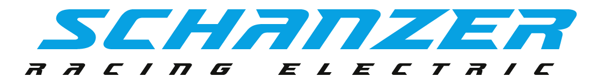

# Schanzer Racing Electric

Welcome to the Github Organisation of Schanzer Racing Electric! We are a student team from the Technical University of Ingolstadt and we are building an electric racecar to compete in the Formula Student Electric competition. Our team consists of students from various fields of study, such as mechanical engineering, electrical engineering, computer science, business administration and many more. We are always looking for new members to join our team and help us build the best electric racecar possible. If you are interested in joining our team, please visit our [website](https://schanzer-racing.de) or contact us via [email](mailto:info@schanzer-racing.de).
